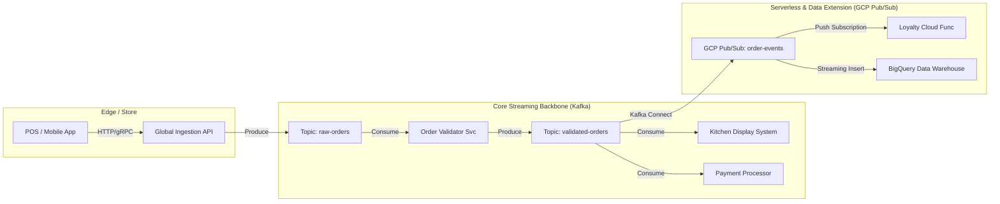

# Step 1: High-Level Architecture: The Global Event Mesh

## 1.1 Objective
Build a store-and-forward event mesh capable of handling "McDonald's scale" (thousands of orders/sec). The system uses Kafka as the durable, ordered log for core transactions and GCP Pub/Sub for serverless fan-out and analytics.

## 1.2 Architecture Diagram

## 1.3 How It Works (The Event Flow)
1.  **Ingestion (Async Boundary):**
    *   Client -> API Gateway (HTTP/gRPC) -> Kafka `raw-orders`.
    *   Immediate Ack (HTTP 202) to client. This decouples ingestion latency from processing.
2.  **Processing (The Stream):**
    *   **Validation:** Consumer reads `raw-orders`, validates inventory/fraud, produces to `validated-orders`.
    *   **Fulfillment:** Kitchen System listens to `validated-orders` only.
3.  **Extension:**
    *   Kafka Connect bridges high-value events to **GCP Pub/Sub**.
    *   Allows Data Science/Loyalty teams to build off the stream without impacting core transaction stability.

## 1.4 Failure Scenarios & Recovery
*   **Consumer Crash:** Kafka consumer groups track offsets. Restarts resume from last committed offset. Zero data loss.
*   **Poison Pill:** Malformed messages sent to Dead Letter Topic (DLT) after 3 retries.
*   **Regional Outage:** Active-Passive multi-region replication (MirrorMaker 2). DNS flip to secondary region.

## 1.5 Interview Talking Points

### The 30-Second Pitch
"I designed a hybrid event-streaming platform using Kafka as the durable transactional backbone and Pub/Sub for serverless scalability. By decoupling ingestion from processing with an async boundary, we achieved high throughput during peak load while ensuring zero data loss through strict acknowledgement protocols and offset management."

### The 2-Minute Deep Dive
"For a system at this scale, tight coupling is the enemy. I chose an **Event-Driven Architecture (EDA)** where the 'Order Placed' event becomes the single source of truth.

I utilized **Kafka** for the core order path because we needed strict ordering—an order cannot be 'Cooked' before it is 'Paid'. Kafka’s partition key strategy (hashing by `OrderID`) guarantees this sequence.

However, for peripheral systems like Loyalty and Data Warehousing, strict ordering is less critical than ease of integration. So, I architected a **Kafka Connect bridge to GCP Pub/Sub**. This empowered our Data Science teams to hook up Cloud Functions and BigQuery streams independently, without risking the stability of the core transaction cluster.

From an SRE perspective, this separation separates our failure domains. If the Data Warehouse pipeline gets backed up, it creates backpressure on the Pub/Sub connector, but the Kitchen Display System (reading from Kafka) remains completely unaffected."
